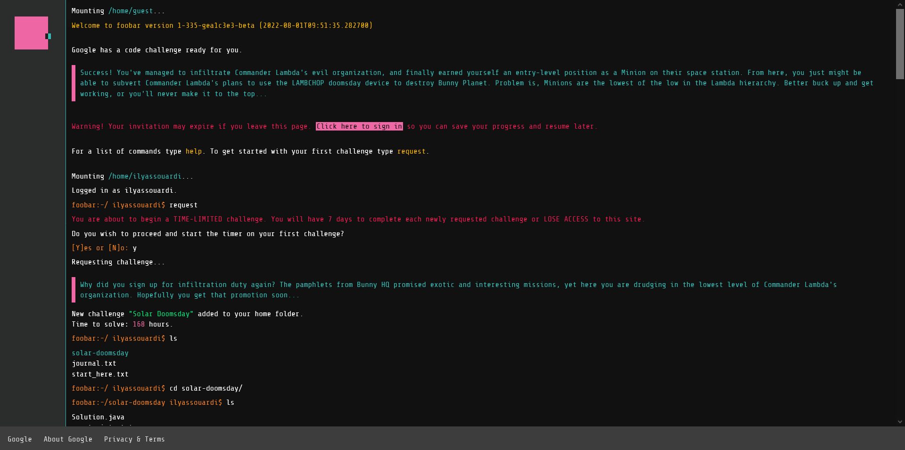

# My Google Foobar Challenge
Foobar is a semi-secret hiring challenge Google put out there to find talented developers. Foobar is a series of five levels of algorithmic questions of ever-increasing difficulty and allotted time to solve these questions. Once the developer requests a question, the clock starts ticking.
For every problem, you can either submit a solution written in Python (2.7) or Java. Before submitting, you can also validate your solution and run it against a suite of secret tests.

What is cool about Foobar is that it takes place on a virtual server, to which you gain access once invited into the challenge.

  

-

### Level 1 - [Solar Doomsday](level-1/solar-doomsday)

### Level 2

### Level 3

### Level 4

### Level 5

----

  

